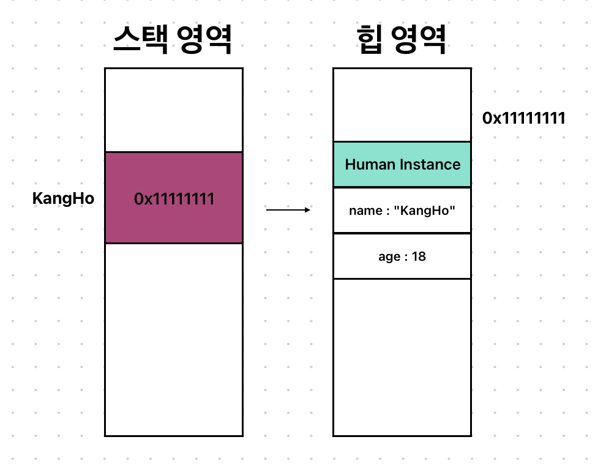
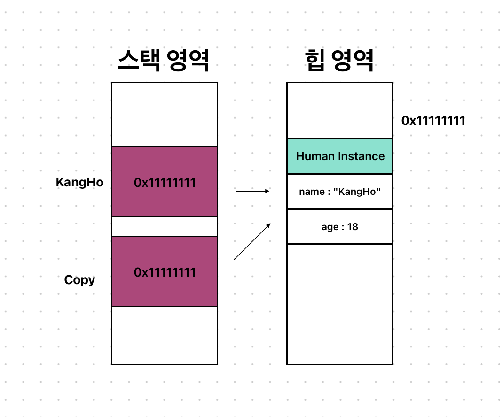
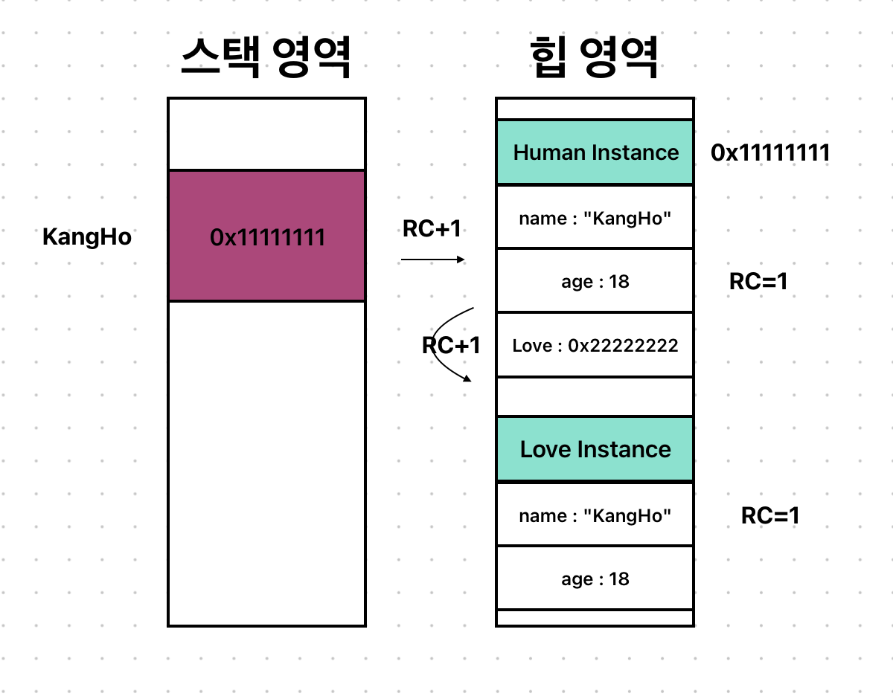
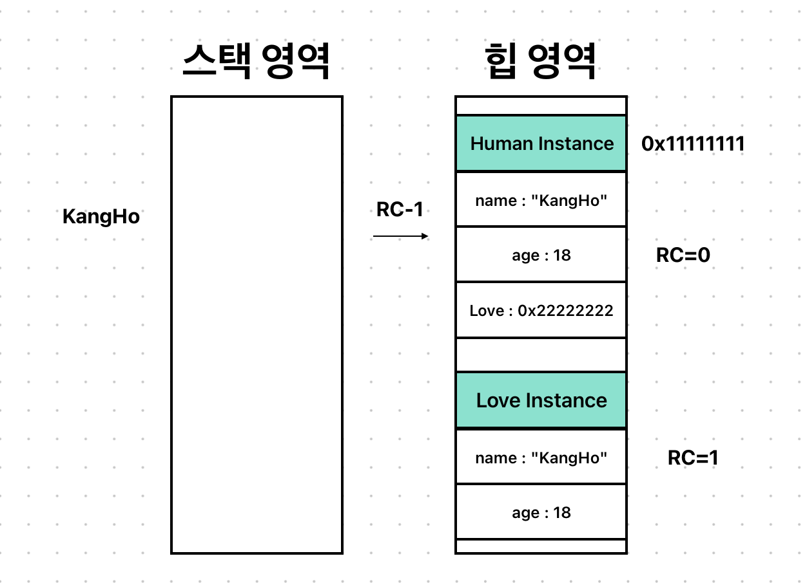
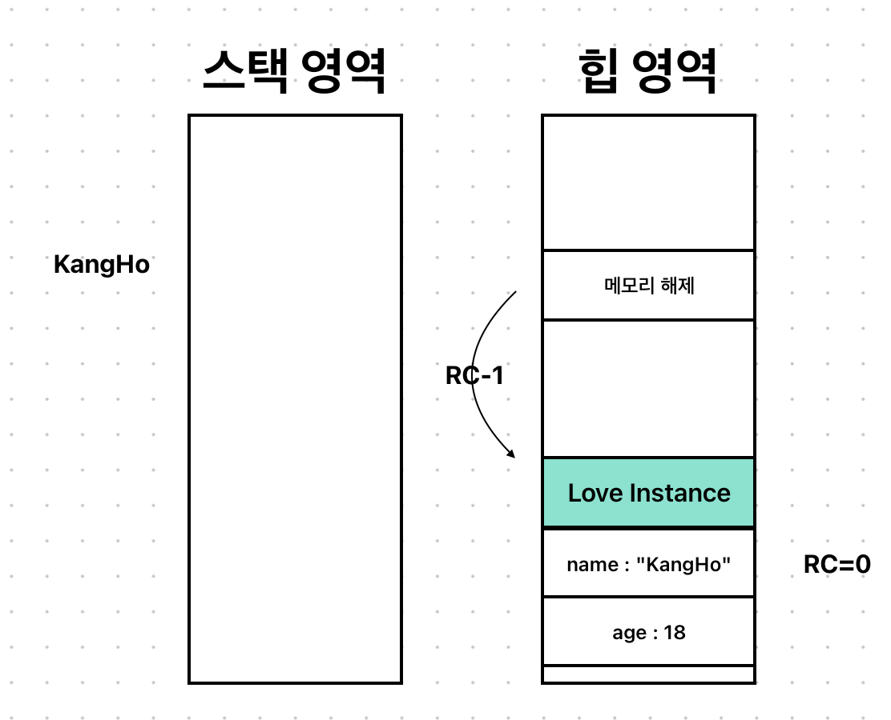
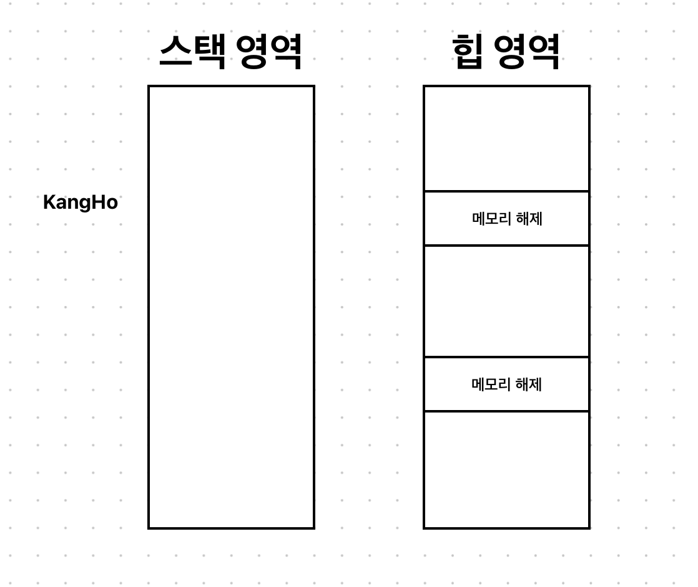

# ARC
Swift에서의 메모리 정리 방식의 첫번째,
### ARC란 무엇인가!!
___
먼저 ARC에 알아보기 전에 참조 타입과 힙에 대해서 한번 알아보자.

ARC가 메모리 영역 중에서 힙 영역을 관리하기 때문에 알아보자는 것이다.

메모리 구조에 정리되있는 것처럼 참조 타입 같은 것들은 모두 자동을 힙에 할당되게 된다.

예제로 한번 봐보자.
```swift
class Human {
    var name: String?
    var age: Int?

    init(name: String, age: Int) {
        self.name = name
        self.age = age
    }
}
```
```swift
let kangHo = Human(name: "KangHo", age: 18)
```
위처럼 Huma이란 클래스가 있고 kangHo라는 인스턴스를 생성 및 초기화를 시켰다.

위코드에선 kangHo라는 인스턴스를 지역 변수라고 가정하자.

그렇게 되면 메모리엔

위와 같이 저장되게 된다.
스택에 있는 KangHo는 힙 영역에 있는 Human 인스턴스를 참조하기 때문에 KangHo안에는 힙의 할당되어 있는 Human 인스턴스의 주소 값이 들어가게 되는 것이다.

KangHo는 참조타입이기 때문에 
```swift
let copy = kangHo
```
이런식으로 해주면 인스터가 복사는 안되고

이런식으로 같은 힙 영역을 가리키게 된다.

이 힙은 사용하고 난 후에는 반드시 메모리 해제를 해주어야 한다.


이런식으로 스택 영역에 있던 KangHo랑 copy가 함수 종료 시점에 사라지고 나면 
힙에 메모리는 누가 해제 시켜주냐?

바로, ARC가 해제해주는 것이다!

이제 한번 ARC에 한번 알아보도록 하자.
___
## ARC란?
ARC는 클래스 인스턴스가 더 이상 필요하지 않을 때 자동으로 메모리를 해제 시켜주는 녀석이다.

우리가 메모리를 할당시키고 나서 직접 해제시키지 않았어도 해제 되었던 이유도 바로 ARC라는 친구 덕분이다.
___
## GC / RC
힙 영역의 메모리 관리에는 2가지가 있는데 GC와 RC가 있는데
* GC : Garbage Collection (자바에서 사용)
* RC : ARC (swift에서 사용)
둘의 큰 차이점은 바로 참조를 계산하는 시점이다.
### GC
참조 계산 시점 : Run Time<br>
어플이 실행되는 동안 주기적으로 참조를 추적하여 사용하지 않는 인스턴스를 해제 시킨다.<br>

장점 : RC보다 인스턴스 해제될 확률이 높다. <br>

단점 : 개발자가 참조 해제 시점을 파악할 수 없고, Run Time 시점에 계속 추적하는 추가 리소스가 발생해 성능 저하를 일으킬 수 있다.
### RC
참조 계산 시점 : Compile Time
컴파일 시점에 언제 참조되고 해제되는지 결정되어 런타임 때 그대로 실행된다.

장점 : 개발자가 참조 해제 시점을 알 수 있고, Run Time 시점에 추가 리소스가 발생하지 않는다.

단점 : 순환 참조가 발생 시 영구적으로 메모리가 해제되지 않을 수 있다.
___
## MRC / ARC
둘 다 RC지만 앞에 붙어있는 M(Manual) 과 A(Automatic)의 차이이다.

MRC는 힙에 메모리를 직접 할당/해제 시켜주는 것이다.

이 방법은 2011년도 이전에 Objective-C가 사용햇던 방법이다.

옛날 Objective-C를 활용한 코드를 봐보면 retain, release라는 함수들을 봐볼 수 있을 것이다.
___
## ARC의 메모리 관리 방법
ARC의 메모리를 관리하려면 Reference Count를 사용해야되는데
### Reference Count란?
메모리의 참조 횟수(RC)를 계산하여 참조 횟수가 0이되면 더 이상 사용하지 않는 메모리라고 생각하게 되어 해제된다.

만약 참조 횟수가 5라면 해당 인스턴스가 5군데에서 참조되고 있다는 뜻이고, 참조 횟수가 0이라면 아무대서도 참조되지 않으니 해제시키라는 뜻이다.
> 모든 인스턴스들은 각자 자신의 RC값을 가지고 있다!!

이 RC를 어떤식으로 과연 셀까?
___
## 참조 횟수 세기 (Count Up / +1)
참조 횟수가 +1이 되는 경우는 인스턴스의 주소값을 변수에다가 할당할 경우에 +1을 해주게 된다.

이를 두가지 경우로 한번 나누어 보자.
### 1. 인스턴스를 새로 생성시킬 경우!
```swift
let kangHo = Human(name: "KangHo", age: 18)
```
위에서 차차 알아봤던 이 코드는 실행되는 시점에 지역 변수 KangHo는 스택에 Human 인스턴스는 힙에 할당된다고 했었다.


위처럼 인스턴스를 생성하게 되면 다음과 같이 RC에 +1 된다는 것을 알 수 있다.

### 2. 기존 인스턴스를 다른 변수에다가 대입을 시킬 경우!
```swift
let copy = kangHo
```
위에서 차차 알아봤던 이 코드처럼 기존 인스턴스를 다른 변수에 대입할 때에도 참조에 의하기 때문에

.png)
위와 같이 RC에 값이 하나 더 증가되는 것을 볼 수가 있다.
___
## 참조 횟수 세기 (Count Down / -1)
참조 횟수는 언제 내려가게 되는지 알아보자.
### 인스턴스를 가리키던 변수가 메모리에서 해제되었을 때
```swift
func Cloning(_ origin: Human) {
    let copy = origin
}

let kangHo = Human(name: "KangHo", age: 18)
Cloning(copy)
```
위 코드를 봐보면 
 
* kangHo 인스턴스가 생성되는 순간에 인스턴스의 RC에 +1이 된다.<br>
* Cloning 함수가 실행되어서 copy라는 인스턴스를 생성하고 Human을 참조하는 순간에 인스턴스의 RC에 +1이 또 된다.<br>
* 그리고 Cloning 함수가 끝나는 시점에 지역변수 clone이 스택에서 해제되는 순간에 인스턴스의 RC가 -1이 된다.

### nil이 지정될 경우
nil이 지정된다는 것은 옵셔널 타입이라는 것인데,
```swift
var kangHo: Human? = .init(name: "KangHo", age: 18)
var copy = kangHo

copy = nil
kangHo = nil
```
위 코드를 봐보면 
* kangHo라는 인스턴스를 만들면 인스턴스의 RC에 +1 // RC=1
* copy로 참조했을 때 인스턴스의 RC에 +1 // RC=2
* copy에 nil을 넣었을 때 인스턴스의 RC에 -1 // RC=1
* kangHo에 nil을 넣었을 때 인스턴스의 RC에 -1 //RC=0

### 변수에 다른 값을 대입했을 경우
```swift
var kangHo: Human? = .init(name: "KangHo", age: 18)
var copy: Human? = .init(name: "JunHo", age: 18)

kangHo = copy
```
위 코드를 봐보면
* kangHo 인스턴스 생성 // kangHo 인스턴스 RC = 1
* copy 인스턴스 생성 // copy 인스턴스 RC = 1
* kangHo에 copy 대입 // kangHo 인스턴스 RC = 0, copy 인스턴스 RC = 2
  
kangHo 변수에 지정된 주소 값이 copy의 주소값으로 바뀌니 참조 카운트도 같이 변하는 것이다.

그러므로 kangHo 인스턴스는 ARC에 의해서 자동으로 메모리에서 해제되게 된다.

### 프로퍼티의 경우, 속해 있는 클래스 인스턴스가 메모리에서 해제될 때
```swift
class Love {
    var girlFriend: String?
    var boyFriend: String?

    init(girlFriend: String?, boyFriend: String?) {
        self.girlFriend = girlFriend
        self.boyFriend = boyFriend
    }

    deinit { print("Love Deinit") }
}
```
```swift
class Human {
    var name: String?
    var age: Int?
    var love: Love? = .init(girlFriend: "no", boyFriend: "no")

    init(name: String, age: Int) {
        self.name = name
        self.age = age
    }
}
```
```swift
let kangHo: Human? = .init(name: "kangHo", age: 18)
kangHo = nil
```
위의 코드를 봐보면 Human이라는 클래스안에 Love 클래스 인스턴스가 존재한다.

메모리로 본다면 다음과 같다.



kangHo가 가리키던 인스턴스가 메모리에서 해제될 경우, Love의 RC또한 같이 감소한다.

### 1번째 단계
kangHo에 nil을 주는 순간 kangHo가 가리키던 Human 인스턴스의 RC에 -1


### 2번째 단계
ARC에 의해서 Human 인스턴스의 RC가 0이니 메모리에서 자동 해제된다.

이때 Human 인스턴스 가지고 있던, love라는 프로퍼티가 가리키던 Love 인스턴스의 RC에 -1



### 3단계
ARC에 의해서 Love 인스턴스의 RC또한 0이니 메모리에서 자동 해제된다.


___
이상으로 메모리 관리의 첫번째, ARC에 대한 공부를 마치도록 하겠다.
참고 자료

[개발자 소들이](https://babbab2.tistory.com/26)