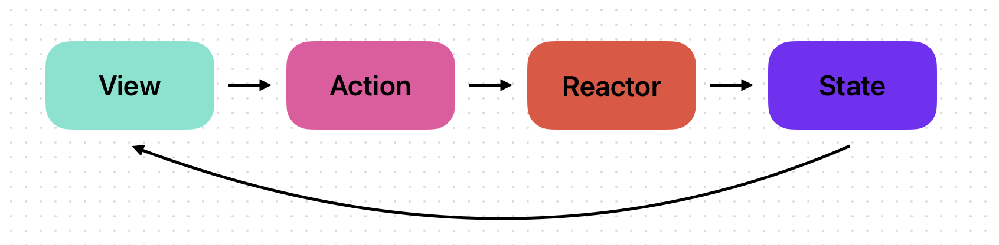

# ReactorKit

ReactorKit의 개념에 대해 한번 배워보자!!
### ReactorKit이란?
RxSwift의 강점인 비동기 처리로 편리한 코드고 API를 통해 앱에서 연속적인 페이지 로드를 할 때 이전 페이지를 기록해놓아야 하듯이, 이전 페이지를 기록하는 '상태' 컴포넌트가 따로 관리하게끔 해주는 구조를 말한다. 
'상태' 라는 컴포넌트 추상화 개념이 적용되어 있고, 컴포넌트 간 결합도가 낮아서 테스트하기에 용이한 구조 및 형식이 갖추어진 형태이다.

#### 여기서!!!
### 컴포넌트?
UI에 해당하는 View와 UI에 미리 반응해서 비즈니스 로직을 처리하는 Reactor로 구성되는 것으로, Reactor에 View의 Action을 미리 정의해놓은 다음 해당 action을 처리해서 다시 View에 State 값을 넘긴다.  
View에서는 인터렉터 이벤트들을 Reactor의 Action 값으로 넘기고, reactor의 state값을 구독하고 UI를 업데이트 한다.

## View

UI가 있고 UI들의 action을 reactor에 넘기고 reactor의 state를 구독하고 있는 형태이다.

## Reactor

### 1. Action
View로부터 받을 Action을 enum으로 정의한다.

### 2. Mutation
View로부터 Action을 받은 경우, 해야할 작업 단위들을 enum으로 정의한다.

### 3. State 
현재 상태를 기록하며, View에서 해당 정보를 사용하여 UI 업데이트 및 Reactor에서 image를 얻어올 때 page 정보들을 저장한다.

### 4. mutate(action:) -> Observable<Mutation>
Action이 들어온 경우 어떤 처리를 할 것인지 Mutation에서 정의한 작업 단위들을 사용하여 Observable로 방출 시킨다. 
해당 부분에서 RxSwift의 concat 연산자를 사용하여 비동기 처리를 하는데 유용하다.

>concat 연산자 : 여러 Observable이 배열로 주어질 시 순서대로 실행시킨다.

### 5. reduce(state:mutation:) -> State
현재 상태와 작업 단위를 받아서 최종 상태를 반환시킨다.
___
이상으로 ReactorKit의 개념에 대한 내용을 마치도록 하겠다.