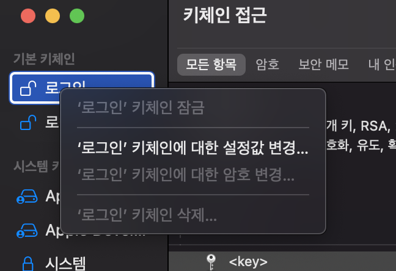

# 키체인 오류
### 이번에는 Xcode에서 가끔 갑작스럽게 일어나게 되는 부분이 있는데 

(나는 해결하기 전 사진을 못찍어서 다른사람꺼 사진 가져옴 ㅎ)

### 쨌든!
이런 다이얼로그를 한번씩 본사람도 있을거고 없을수도 있을 것이다.

쨌든 이런 다이얼로그를 어떻게 해결하는지에 대해서 이번에 한번 알아보겠다!!

___
### 첫번째 방법

먼저 맥북 비번을 아시는 분들은 왼쪽아래에 항상 허용이라는 버튼이 뜰껀데 그걸 누르면 해결이 된다고 한다. 👍
___
### 두번째 방법

키체인 접근에 들어가준다.

이런식으로 keychain 암호값 변경을 눌러서 값을 바꿔준다!!

### 그러면 된다!!

___
이상으로 KeyChain오류 관련 문제에 대한 해결 방안 소개에 대해 마치도록 하겠다.