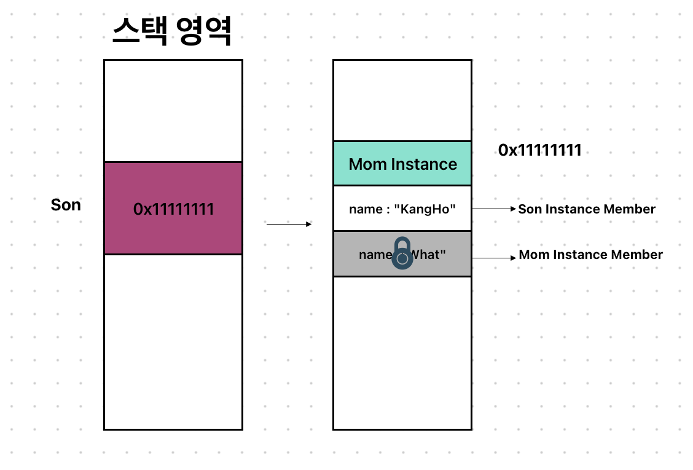

# Type Casting / as
```swift
표현식 as (변환 괄호)Type
표현식 as? (변환 괄호)Type
표현식 as! (변환 괄호)Type
```
as는 위와 같은 형태로 사용하며 표현식의 타입이 변환할 Type과 호환될 시 변환될 Type으로 캐스팅 된 인스턴ㅅ흐를 리턴한다.

상속관계인 UpCasting, DownCasting에서 사용하고, Any, AnyObject 타입 같이 상속 관계가 아니여도 예외적으로 사용할 수 있다.

여기서 업캐스팅과 다운캐스팅에 대해서 뭔지 궁금해할 수 있다.

그러니 한번 알아보자.
## Upcasting
서브 클래스 인스턴스를 **슈퍼 클래스의 타입**으로 참조한다.
Upcasting은 항상 성공하고, as 연산자를 사용해서 할 수도 있다.

is부분에서 다음과 같은 예제를 썼었는데,
```swift
class Son {
    let name: String
    init(name: String) {
        self.name = name
    }
}

class Mom: Son {}
class Dad: Son {}

let family: [Son] = [
    Mom.init(name: "우리엄마")
    Dad.init(name: "우리아빠")
    Dad.init(name: "큰아빠")
]
```
Mom이라는 클래스와 Dad라는 클래스는 분명 서로 다른 타입의 클래스이다.

그런데 어떻게 family라는 배열안에 두 타입의 인스턴스가 들어가게 된걸까?

바로 Upcasting 덕분이다.

Mom, Dad 클래스는 둘 다 슈퍼클래스가 Son으로 동일하기 때문에 이 둘을 Son이라는 클래스로 Upcasting 해서 묶어버릴 수 있었던 것이다.

위 코드를 좀 손봐서 봐보자.
```swift
class Son {
    let name: String = "KangHo"
}

class Mom {
    let namee: String = "What"
}

class Dad {
    let name: String = "awesome"
}
```
```swift
let son = Mom.init() as Son
```
이런 코드를 짰을 때 as를 이런식으로 사용한다.

위 코드의 의미는 Mom 타입의 인스턴스를 생성하지만 이를 Son 타입으로 Upcasting 시켜서 Son에 저장시키기겠다는 뜻으로 보면 되겠다.

메모리에는 어떤식으로 올라갈까?

실제 Son의 타입은 업캐스팅된 Son 타입이지만 그렇다고 Son의 메모리만 들어가는게 아니고 우리가 Mom이라는 인스턴스를 만들었기 때문에 Mom이라는 인스턴스가 그대로 올라가게 된다.

Son이 Mom이라는 서브 클래스를, Son이라는 슈퍼클래스 타입으로 참조하는 Upcasting 한 것이기 때문에 son의 접근 범위가 "Son"의 멤버로 한정되게 되는 것이다.
```swift
son.name // KangHo
son.namee // error!!
```
이렇게 Son 클래스의 멤버인 name엔 접근을 할 수 있지만, 서브 클래스인 Mom의 멤버인 namee에는 접근을 할 수가 없다.

이렇게 서브 클래스의 인스턴스를 슈퍼 클래스 타입으로 참조하는 것을 Upcasting이라고 한다.