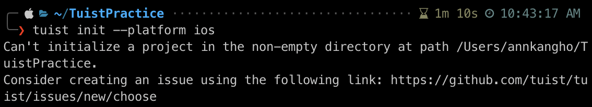
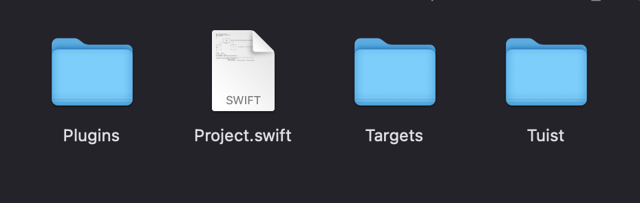
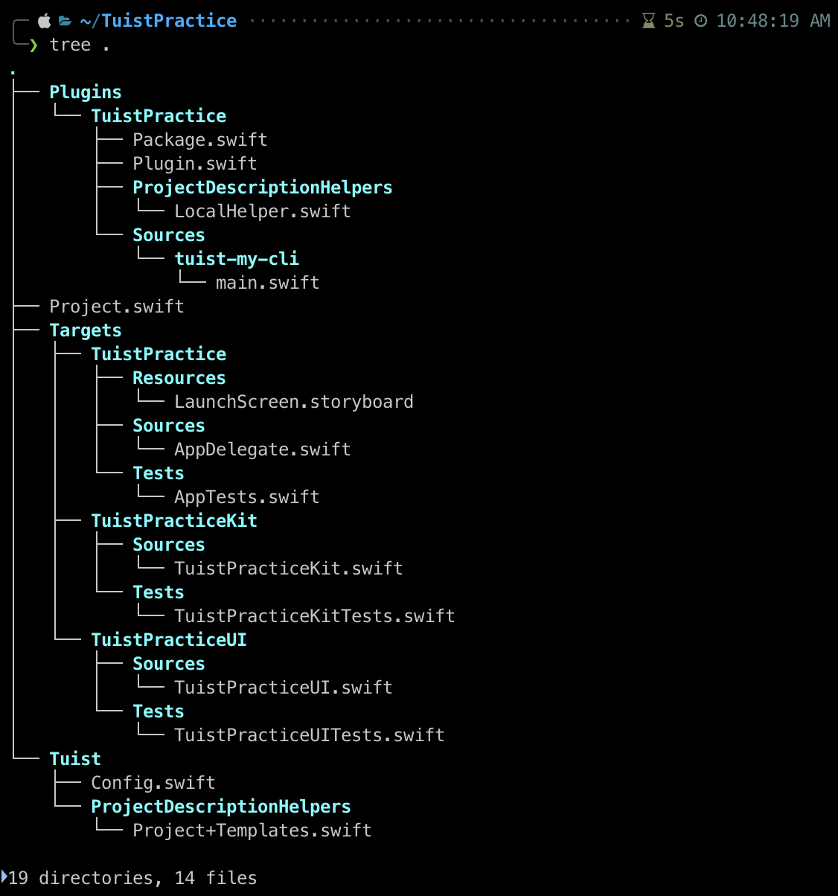
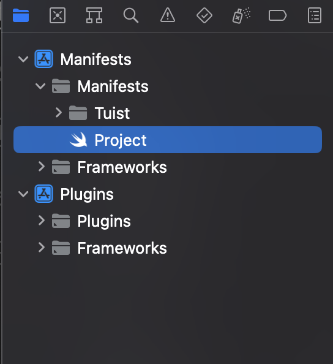
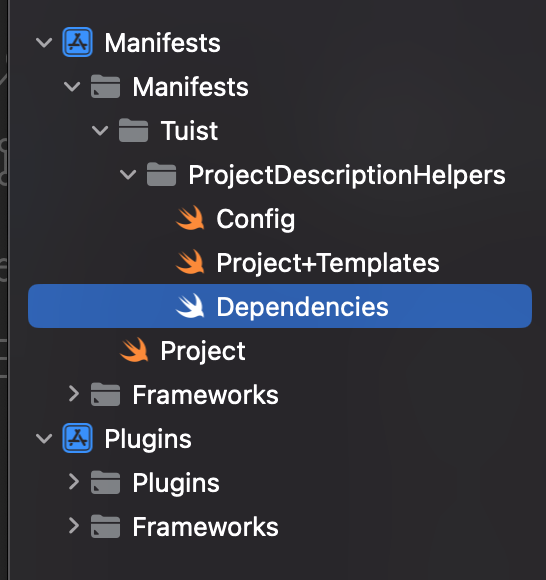
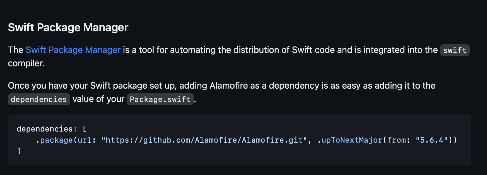

# Tuist
## Tuist란?
Xcode에서 프로젝트를 관리할 수 있는 툴.
## Tuist 장점
* 모듈화 가능 
    - 모듈화를 하면 모듈별 의존성이 낮아지고 재활용 가능성이 높아짐.
    - 유지보수 하기 좋은 구조가 된다.
    - 빌드 속도가 빨라진다.
* 협업 상황에서 머지할 때 충돌사고를 조금이라도 줄일 수 있음.
## Tuist로 세팅해보기
### Tuist 설치
터미널에 다음과 같이 치자.
> curl -Ls https://install.tuist.io | bash
### Tuist로 iOS 프로젝트 생성
Tuist로 iOS 프로젝트를 생성할 때 폴더를 비워주지 않으면 다음과 같은 오류가 발생한다.

위 오류가 뜨는 이유는,<br>
자기가 사용할 프로젝트를 처음에 비워주지 않아서 나는 것 같다!

그러니, 자신이 사용할 프로젝트를 들어가서 파일 안을 비워준 뒤, 다음과 같이 터미널에 입력해주자.
```
cd 들어갈 프로젝트
tuist init --platform ios
```
만약 성공했다면

자신이 사용할 프로젝트 안에 저렇게 4개의 파일이 들어가는 것을 확인할 수 있을 것이다.
### 예제 파일 생성
tree를 설치하기 위해서 터미널에 다음과 같이 입력하자.
```
brew install tree
```
나는 맥북이 m2칩이라 저렇게 입력하면 되는데 m1칩인 경우에는
```
arch -arm64 brew install [pacakge name]
```
위와 같이 입력해주자!

자신이 만든 파일에 들어가서
```
tree .
```
위와 같이 입력하게 되면 

위 사진과 같이 예제 파일이 생성됐다는 것을 알 수 있다!

### project 파일 수정하기
```
tuist edit
```
프로젝트에 들어가서 위와 같이 입력해주게 되면,<br>
자동으로 xcode가 열리게 된다.

이제 아래와 같이

Project.swift에 가서 이걸 수정해야한다.

-> [Tuist 공식 문서](https://docs.tuist.io/tutorial/get-started/)<br>
위의 apple 공식문서를 참고 해보면 아래처럼 코드로 나와있는데
```swift
import ProjectDescription

let project = Project(
    name: "MyApp",
    organizationName: "MyOrg",
    targets: [
        Target(
            name: "MyApp",
            platform: .iOS,
            product: .app,
            bundleId: "io.tuist.MyApp",
            infoPlist: "Info.plist",
            sources: ["Sources/**"],
            resources: ["Resources/**"],
            headers: .headers(
                public: ["Sources/public/A/**", "Sources/public/B/**"],
                private: "Sources/private/**",
                project: ["Sources/project/A/**", "Sources/project/B/**"]
            ),
            dependencies: [
                /* Target dependencies can be defined here */
                /* .framework(path: "framework") */
            ]
        ),
        Target(
            name: "MyAppTests",
            platform: .iOS,
            product: .unitTests,
            bundleId: "io.tuist.MyAppTests",
            infoPlist: "Info.plist",
            sources: ["Tests/**"],
            dependencies: [
                .target(name: "MyApp")
            ]
        )
    ]
)
```
```
tuist generate
```
이 코드를 그대로 사용하면 프로젝트가 성공적으로 생성될 순 있다.

하지만, 우리가 원하는 건 아닐 것 같기 때문에 설정을 한 번 바꾸러 가보자.

### dependencies 설치
-> [공식 문서](https://docs.tuist.io/guides/third-party-dependencies/)
위의 공식 문서를 보고 한번 해보자.

Dependencies 파일이 만들어져있다면 추가를 하고 그게 아니라면 새로 만들어 주자.

난 여기에다가 만들었다.

이제 깔아야 되는 라이브러리를 알아두자.
나는 Alamofire를 설치 할 것이다.

위의 사진과 같이 깃허브 들어가서 SPM 부분을 확인하자.

나는 아래와 같이 추가해주었다.
```swift 
//
//  Dependencies.swift
//  ProjectDescriptionHelpers
//
//  Created by AnnKangHo on 2023/06/17.
//

import ProjectDescription

let dependencies = Dependencies(
    swiftPackageManager: [
        .remote(url: "https://github.com/Alamofire/Alamofire.git", requirement: .upToNextMajor(from: "5.6.4"))
    ],
    platforms: [.iOS]
)
```
이러고 난 후에 다시 Project 파일로 돌아와서 추가해줬던 라이브러리를 dependencies에 적어준다.
```swift
dependencies: [
    .external(name: "Alamofire")
]
```
## SceneDelegate 추가해주기

Tuist를 다 세팅하게 되면 Xcode가 ScenDelegate 파일이 따로 추가가 되지 않는다.

그러니 info에 다음과 같이 넣어주자.
```swift
let infoPlist: [String: InfoPlist.Value] = [
        "CFBundleVersion": "1",
        "UILaunchStoryboardName": "LaunchScreen",
        "UIApplicationSceneManifest": [
            "UIApplicationSupportsMultipleScenes": false,
            "UISceneConfigurations": [
                "UIWindowSceneSessionRoleApplication": [
                    [
                        "UISceneConfigurationName": "Default Configuration",
                        "UISceneDelegateClassName": "$(PRODUCT_MODULE_NAME).SceneDelegate"
                    ],
                ]
            ]
        ],
    ]
```
