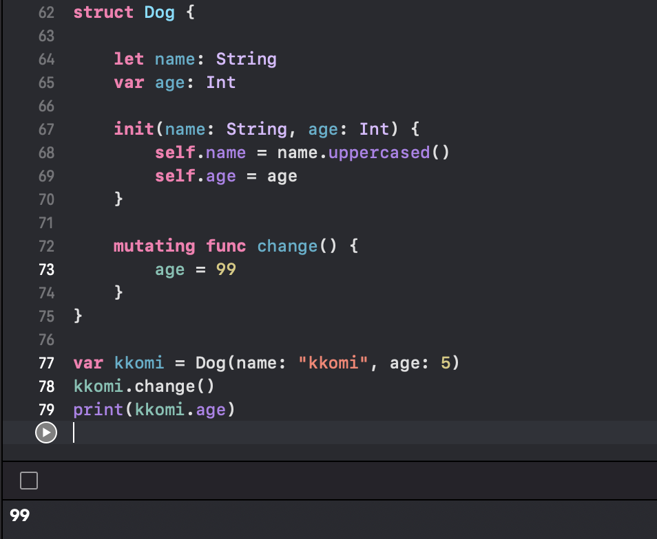

# mutating
## mutating이란?
특정 메소드 내에서 구조체 또는 열거형의 프로퍼티를 수정해야 되는 경우, 해당 메소드의 동작을 변경하도록 하는 것이다.
___
## 코드로 한번 알아보기
코드로 한번 알아보자!
```swift
struct Dog {
    
    let name: String
    var age: Int

    init(name: String, age: Int) {
        self.name = name.uppercased()
        self.age = age
    }
    
    func change() {
        age = 99 // error!
    }
}
```
위와 같이 name이랑 age라는 프로퍼티와 chang라는 메소드, 그리고 init을 통해서 초기화도 같이 해주었다. 그런데 저 코드를 실행해보면 메소드안에서 age부분을 바꾸려고 할 때 에러가 발생할 것이다.

### 왜 에러가 발생하냐!

구조체 안에서는 메소드 안의 값을 수정할 수 없기 때문에 위와 같은 코드에서 값을 바꾸려고 하면 에러가 발생하는 것이다.

이 에러를 해결하기 위해서 한번 mutating을 사용하여 코드를 다시 써보자.

```swift
struct Dog {
    
    let name: String
    var age: Int

    init(name: String, age: Int) {
        self.name = name.uppercased()
        self.age = age
    }
    
    mutating func change() {
        age = 99 
    }
}
```
이런식으로 해주게 되면
```swift
var kkomi = Dog(name: "kkomi", age: 5)
kkomi.change()
print(kkomi.age)
```
이런식으로 kkomi라는 인스턴스를 하나 생성하고 메소드에 접근해보면...

이런식으로 맨처음에 5로 초기화를 했어도 99로 바뀌어서 출력이 되는 것을 확인 할 수 있을 것이다.
___
이상으로 mutating에 대한 공부를 마치도록 하겠다.