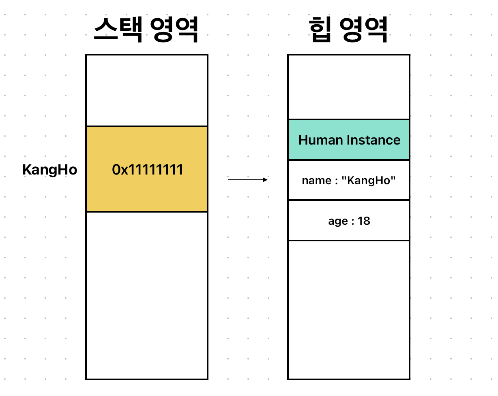
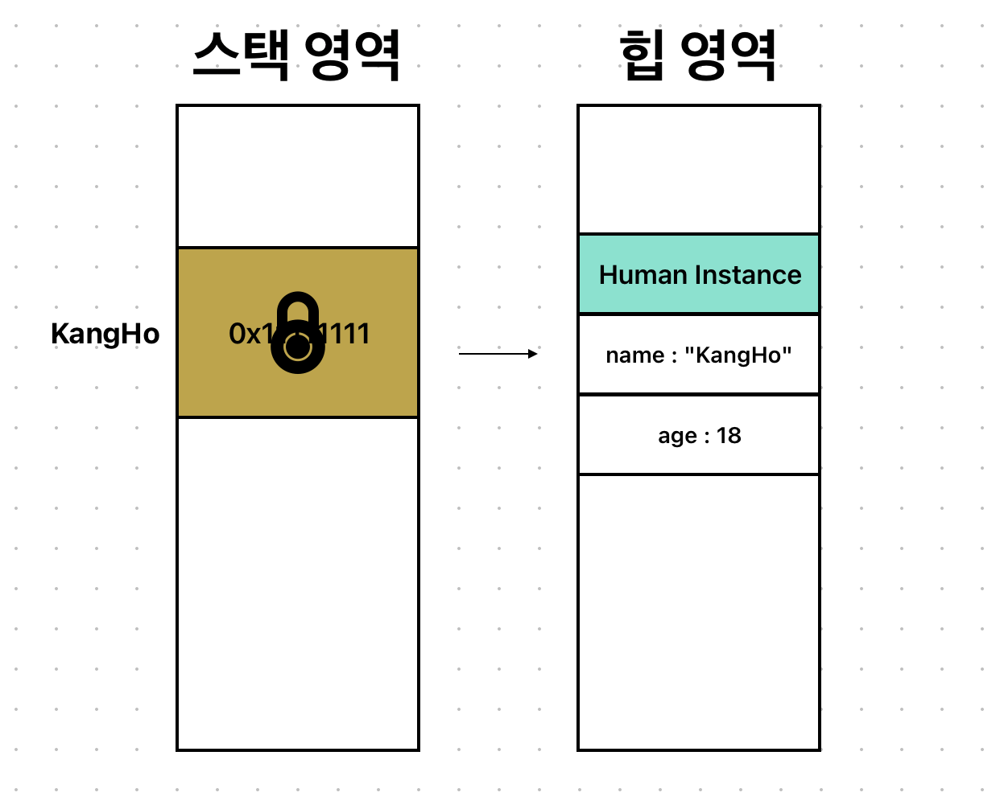

# Stored Property

#### Stored Property를 소개하기에 앞서!

### Property란?
우리가 지금껏 사용해왔던 클래스나 구조체에서 선언하던 상수나 변수를 뜻한다.

Swift에서는 다음과 같이 3가지 형태로 구분된다.
* Stored Property : 저장 프로퍼티
* Computed Property : 연산 프로퍼티
* Type Property : 타입 프로퍼티

## Stored Property란?
클래스와 구조체에서만 사용할 수 있고, 값을 저장하기 위해 선언되는 변수/상수이다.
```swift
class Man {
    let name: String = "nope"
    var age: Int = 0
}
 
struct Woman {
    let name: String = "nope"
    var age: Int = 0
}
```
Man이랑 Waman이란 구조체에 저장된 name이라는 상수와 age라는 변수는 모두 다 Stored Property이다!

## class 인스턴스를 let/var로 선언?
```swift 
let kangHo: Man? = .init()
```
만약에 kangHo라는 옵셔널 **상수**로 Man이라는 Class 인스턴스를 만들었다.

이때 선언을 지역변수 위치라고 가정하여 저장 프로퍼티인 name과 age를 각각 변경해본다면??

```swift
kangHo?.name = "KangHo" //error!!!
kangHo?.age = 18
```
name이란 값에는 에러가 발생하고 age란 값 변경에는 문제가 없다!!



Class는 참조타입이기 때문에, 메모리에 위 사진과 같이 저장된다!

지역상수인 kangHo는 스택에 할당 되고, 실제 Man 인스턴스는 힙에 할당된다!

스택에 있는 kangHo는 힙 영역에 있는 인스턴스를 참조하고 있는 형태이다.<br>
따라서 kangHo 안에 힙에 할당된 인스턴스의 주소값이 들어가 있다!

여기서 kangHo라는 Class 인스턴스를 생성할 때 let으로 한다는 것은 바로...



실제 힙 영역에 저장된 저장 프로퍼티 name, age와는 상관없이 스택 영역에 저장된 kangHo 안의 주소값이 상수로 설정된다는 것!!!

그러므로 상수니까 값을 변환 할 수 없음...

### 따라서!!!
클래스의 경우, 인스턴스 생성 당시 let이든, var이든 클래스의 저장 프로퍼티에 접근하는 것엔 아무 영향읊 주지 않음..

kangHo란 스택 상수는 0x11111111이란 인스턴스의 값을 가지고 있는데, <br>
그럼 이제 kangHo란 상수 안의 값을 변경하는데에 영향을 준다!!

```swift
kangHo = nil // error!!
```

상수니까 값이 변경 될 수 없으므로, kangHo란 상수가 옵셔널이긴 위와 같이 nil을 할당할 수 없음..

```swift
let clone: Man? = .init()
kangHo = clone // error!!
```

kangHo란 상수에 다른 인스턴스를 대입할 수도 없음..<br>
(다른 인스턴스 주소 값 가질 수 X)

```swift
var kangHo: Man? = .init()
```

다음과 같이 Class 인스턴스를 생성할 때 var로 한다면...
```swift
kangHo = nil
kangHo = Man.init()
```

옵셔널 타입일 시 nil도 할당 가능하고<br>
다른 인스턴스도 대입할 수 있음!!
