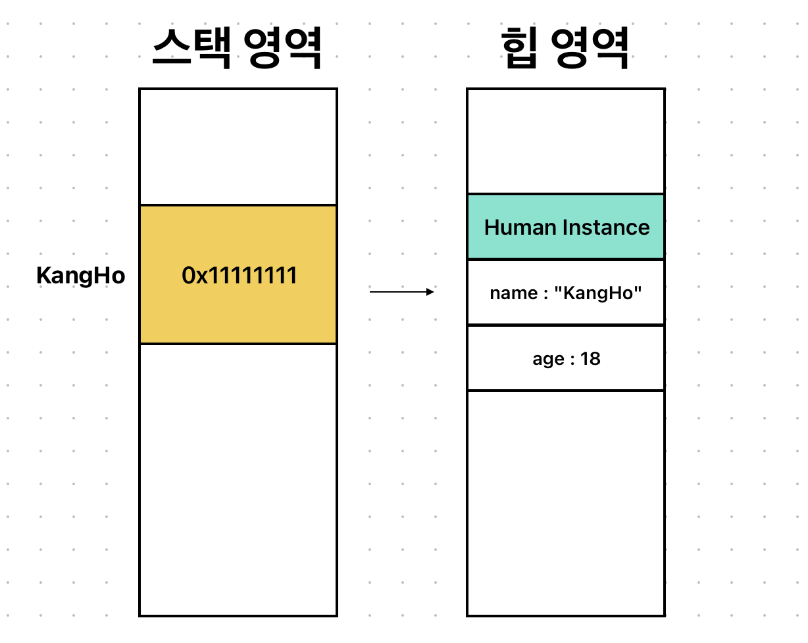

# Stored Property

#### Stored Property를 소개하기에 앞서!

### Property란?
우리가 지금껏 사용해왔던 클래스나 구조체에서 선언하던 상수나 변수를 뜻한다.

Swift에서는 다음과 같이 3가지 형태로 구분된다.
* Stored Property : 저장 프로퍼티
* Computed Property : 연산 프로퍼티
* Type Property : 타입 프로퍼티
___
## Stored Property란?
클래스와 구조체에서만 사용할 수 있고, 값을 저장하기 위해 선언되는 변수/상수이다.
```swift
class Man {
    let name: String = "nope"
    var age: Int = 0
}
 
struct Woman {
    let name: String = "nope"
    var age: Int = 0
}
```
Man이랑 Waman이란 구조체에 저장된 name이라는 상수와 age라는 변수는 모두 다 Stored Property이다!
___
## class 인스턴스를 let/var로 선언?
```swift 
let kangHo: Man? = .init()
```
만약에 kangHo라는 옵셔널 **상수**로 Man이라는 Class 인스턴스를 만들었다.

이때 선언을 지역변수 위치라고 가정하여 저장 프로퍼티인 name과 age를 각각 변경해본다면??

```swift
kangHo?.name = "KangHo" //error!!!
kangHo?.age = 18
```
name이란 값에는 에러가 발생하고 age란 값 변경에는 문제가 없다!!



Class는 참조타입이기 때문에, 메모리에 위 사진과 같이 저장된다!

지역상수인 kangHo는 스택에 할당 되고, 실제 Man 인스턴스는 힙에 할당된다!

스택에 있는 kangHo는 힙 영역에 있는 인스턴스를 참조하고 있는 형태이다.<br>
따라서 kangHo 안에 힙에 할당된 인스턴스의 주소값이 들어가 있다!

여기서 kangHo라는 Class 인스턴스를 생성할 때 let으로 한다는 것은 바로...


실제 힙 영역에 저장된 저장 프로퍼티 name, age와는 상관없이 스택 영역에 저장된 kangHo 안의 주소값이 상수로 설정된다는 것!!!

그러므로 상수니까 값을 변환 할 수 없음...

### 따라서!!!
클래스의 경우, 인스턴스 생성 당시 let이든, var이든 클래스의 저장 프로퍼티에 접근하는 것엔 아무 영향읊 주지 않음..

kangHo란 스택 상수는 0x11111111이란 인스턴스의 값을 가지고 있는데, <br>
그럼 이제 kangHo란 상수 안의 값을 변경하는데에 영향을 준다!!

```swift
kangHo = nil // error!!
```

상수니까 값이 변경 될 수 없으므로, kangHo란 상수가 옵셔널이긴 위와 같이 nil을 할당할 수 없음..

```swift
let clone: Man? = .init()
kangHo = clone // error!!
```

kangHo란 상수에 다른 인스턴스를 대입할 수도 없음..<br>
(다른 인스턴스 주소 값 가질 수 X)

```swift
var kangHo: Man? = .init()
```

다음과 같이 Class 인스턴스를 생성할 때 var로 한다면...
```swift
kangHo = nil
kangHo = Man.init()
```

옵셔널 타입일 시 nil도 할당 가능하고<br>
다른 인스턴스도 대입할 수 있음!!

이것이 Class의 인스턴스를 let과 var로 선언하는 것에 대한 차이를 말해준다!
___
## 구조체 인스턴스를 let/var로 선언?
```swift
let kangHo: Man? = .init()
```

위와 같이 let으로 kangHo라는 인스턴스를 만든 후에 저장 프로퍼티인 name과 age를 각각 변경해본다면...??

```swift
kangHo?.name = "KANGHO" //error!
kangHo?.age = 18 //error!
```
위와 같이 각각 변경해보려 할 시 변경할 수 없다는 에러가 발생하게 된다!

처음 생각했을 때에는 name은 let 즉 상수라 에러가 나는 건 그러려니한데,<br>
age는 변수니까 초기화 이후에 변경할 수 있을 줄 알았는데 안되는게 좀 의문이었다.

그 궁금증을 해결하기 위해서 다음을 한번 봐보자!


구조체는 값타입이기 때문에 위와 같이 메모리에 저렇게 저장된다.

클래스처럼 참조하는 형태가 아니기 때문에, 구조체의 저장 프로퍼티들도 모두 스택으로 올라가게 된다.

여기서 전에 위에서 말했던거와 같이 let으로 구조체를 선언하게 된다면...


위의 사진과 같이 구조체 인스턴스를 let으로 선언하게 되면 선언한 구조체의 모든 멤버를 변경할 수 없게 된다.
* nil도 불가능!
* 다른 구조체에서 인스턴스 할당도 불가능!

여기서도 마찬가지로!
```swift
var kangHo: Man? = .init()
```
위와 같이 구조체 인스턴스를 var로 선언하게 된다면?
```swift
kangHo = nil
kangHo = Man.init()
```
nil이나 다른 구조체 인스턴스 할당 가능!

또한, var로 선언된 저장 프로퍼티도 값을 바꿀 수 있게 된다.

이것이 구조체에서 인스턴스를 let과 var로 선언하는 것에 대한 차이를 말해준다!
___
## 자연 저장 프로퍼티(Lazy Stored Property)
### 지연 저장 프로퍼티란?
프로퍼티가 호출되기 전까지는 선언만 될 뿐 초기화되지 않고 있다가, <br>
프로퍼티가 호출되는 순간에! <br>
초기화 되는 프로퍼티를 말한다.

만약, 다음과 같이 Detail이라는 저장 프로퍼티를 가지는 Man이라는 클래스가 있고 그 Man이라는 클래스 인스턴스를 만들고 초기화 시켰다고 가정하자.
```swift
class Detail {
    var email: String = ""
    var address: String = ""

    init() {print("Detail~~init~~")}
}

class Man {
    var name: String = "Nope"
    var detail: Detail = .init()
}
```
여기서 아래와 같이 kangHo라는 인스턴스를 하나 만들어준다.
```swift
let kangHo: Man = .init()
```
이와 같이 kangHo라는 인스턴스를 만들고 init을 호출하게 되면, <br>Man의 내에 있는 인스턴스의 프로퍼티들이 모두 초기화되고,<br> Detail이란 프로퍼티도 같이 초기화 되게 된다!!

**따라서!!**

다음과 같이 Detail부분을 초기화 시키느 코드가 실행되게 된다!
```
Detail~~init~~  //출력
```
그런데 만약에!

여기서 내가 detail이란 저장 프로퍼티 앞에다가 lazy를 붙이게 된다면
```swift
class Detail {
    var email: String = ""
    var address: String = ""

    init() {print("Detail~~init~~")}
}

class Man {
    var name: String = "Nope"
    lazy var detail: Detail = .init()
}
```
위와 같이 작성되게 될 것이다.

그리고 나서 위에서 했던 것과 똑같이 
```swift
let kangHo: Man = .init()
```
이렇게 인스턴스를 만들고 초기화하게 된다면, <br>
Detail안에 있는 초기화 구문이 실행되지 않을 것이다.<br>
왜냐하면 lazy를 써서 선언만 됐을 뿐 변수자체가 <br>
초기화 된 것은 
아니기 때문이다!!!

만약 내가 detail이라는 변수에 접근을 하고자 한다면
```swift
kangHo.detail.address = "nope"
```
이렇게 할 시 detail이라는 변수가 초기화 되면서 다시
```
Detail~~init~~  //출력
```
위와 같이 출력 되는 것이다!!

### 지연 저장 프로퍼티의 특징??
인스턴스가 초기화와 상관 없이, 처음 사용할 때 개별적으로 초기화가 된다.

따라서! 항상 **변수**로 선언되어야 한다.

왜냐?<br>
lazy let으로 선언될 경우에는 이미 메모리가 올라가 있긴 하지만<br>
우리가 원하는 시점에 원하는 값으로 초기화를 시킬 수 있어야 되는데<br>
그러지 못하기 때문!!!!
___
그럼 이상으로 저장 프로퍼티에 대한 공부를 마치도록 하겠다.