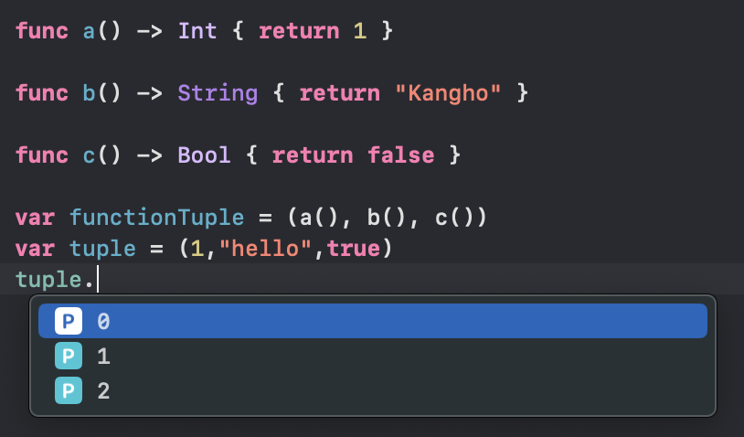
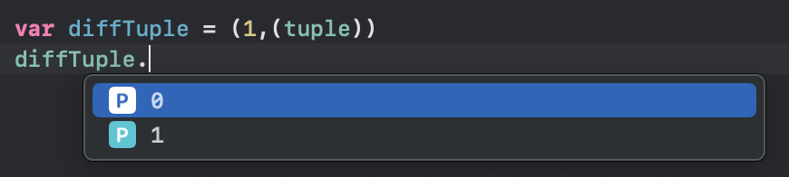
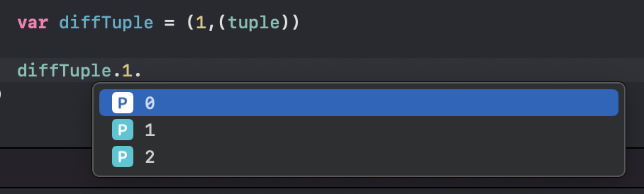
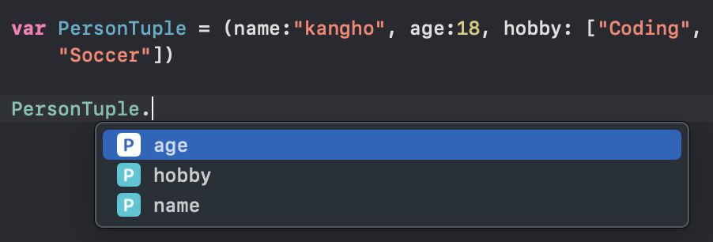
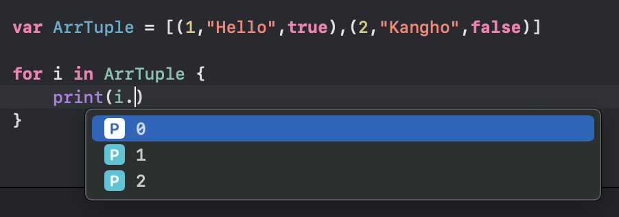
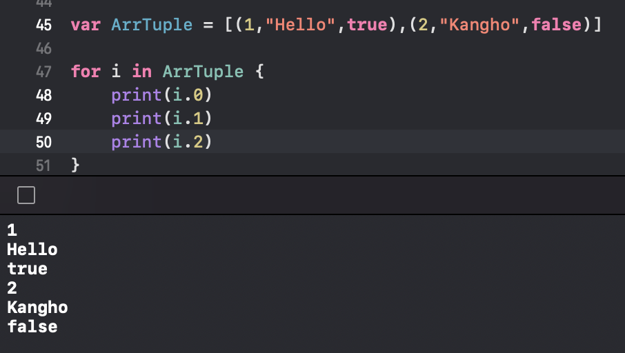
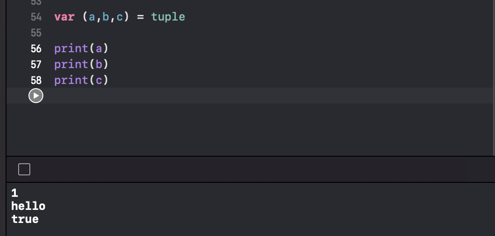

# tuple
## tuple이란?
여러가지 타입을 하나로 묶어서 사용할 수 있는 구조체이다.

### 사용예시
```swift
var tuple = (1,"hello",true)
```
tuple은 compound type인 tuple type이나, function type을 담을 수 있다.
___
## Tuple Type
먼저 tuple type을 담아보자.
```swift
var tuple = (1,"hello",true)
var diffTuple = (1,(tuple))
```
위의 코드를 보면 diffTuple이라는 변수에 tuple이라는 것이 들어간 것을 볼 수가 있을 것이다.

이렇게 tuple은 괄호를 통해서 만들 수 있다.

그렇다고 해서
```swift
var diffTuple = (tuple)
```
이렇게 하는건 굳이 의미 없다는 건 다 알죠?
___
## Function Type
다음으로 function type을 담아보자.
```swift
func A() -> Int{return 1}
func B() -> String{return "kangho"}
func C() -> Bool{return false}
var funcTuple = (A(),B(),C())
```
위와 같이 function type도 tuple로 담을 수 있다.

그래서 저 위에처럼 funcTuple에다가 값을 넣었을 때 어떻게 사용할까?

한번 알아보자!!

위와 같이 만든 변수에다가 .을 찍으면 저렇게 숫자들이 나오는데 이걸 그냥 **index**라고 생각하면 좋을 것 같다.

위의 코드에서 각각의 결과는 다음과 같을 것이다.
```swift
tuple.0 //1
tuple.1 //"Hello"
tuple.2 //true
```

위와 같이 .뒤에다가 인덱스만 적어주면 바로 그 값에 접근이 가능하다.

tuple안에다가 tuple을 넣은 예제도 한번 봐보자.

위에처럼 .을 뒤에 찍으니까 0번쨰 인덱스에는 그냥 Int여서 상관이 없는데 하지만 그 다음인 1번째 인덱스는 tuple 이었으니 tuple 타입인 Int, String, Bool로 다 된다.

만약 diffTuple에서의 tuple의 값에다가 접근을 하려면?


위의 코드를 예시로 들자면 diffTuple의 1번째 인덱스에 tuple의 3번째 인덱스를 들어가는 식으로 .을 두번 사용해서 들어가는 이런 뉘양스로 사용하면 된다 ㅎ

한마디로!

1. 변수에 .찍기
2. 접근할 인덱스 적기
3. 인덱스 안이 투플이 적어져 있다면 또 .찍기
4. 3번에서 말한 투플 안에서 접근할 인덱스 적기

이런식이다.

```swift
var tuple = (1,"hello",true)


var diffTuple = (1,(tuple))

diffTuple.1.0 //1
diffTuple.1.1 //"hello"
diffTuple.1.2 //true
```

하게 되면 위와 같이 쓰면 된다.
___
## Tuple의 원소에 이름 주기
투플의 원소에는 이름을 줄 수가 있다.
### 예시
```swift
var PersonTuple = (name:"kangho", age:18, hobby: ["Coding", "Soccer"])
```
이런식으로 원소에다가 이름을 줄 수가 있다.

**tuple에 배열 들어갈 수 있음!!**

그럼 앞서 적어주었던 Tuple의 원소에 이름을 주지 않은 것과 비교해보면 뭐가 다를까?


위와 같이 점을 찍으면 이름을 주지 않았던 것과 다르게 위에서 우리가 줬던 name, age, hobby로 뜨게 된다!!

결과는 다음과 같을 것이다.
```swift
PersonTuple.name // "kangho"
PersonTuple.age // 18
PersonTuple.hobby // ["Coding","Soccer"]
```

이렇게 .만 붙여서 바로 사용할 수 있다는 메리트.. 정말 간편하지 않나요?

근데 그렇다고 struct말고 tuple을 사용하면 된다고 생각할 수도 있을텐데 

### 안돼요!!

왜냐..

swift 공식문서를 봐보면 튜플은 임시로 그룹지을 때 유용하다는 식으로 나와있다.
```
Tuples are useful for temporary groups of related values.
```
이는 만약 데이터 구조가 임시 범위를 넘어서 존속할 가능성이 있는 경우에는 클래스나 구조체로 모델링 해야한다는 것이다.

자 이제..

tuple에다가 이름을 주는 것을 더 알아보자면
```swift
//1번째
var PersonTuple1 = (name:"kangho", age:18, hobby: ["Coding", "Soccer"])
//2번째
var PersonTuple2: (name: String, age: Int, hobby: [String]) = ("kangho", 18,["Coding", "Soccer"])
```
위와 같이 1번째 코드를 2번째 코드와 같은 형식으로 작성할 수 있다.

2번째 코드도 1번째 코드와 같이 이름으로 접근 가능하다!!

**tuple을 루프로 돌릴 순 없음**

하지만 Sequence 프로토콜를 따르는 배열 안에다가 넣는다면?
```swift
var ArrTuple = [(1,"Hello",true),(2,"Kangho",false)]
```
루프를 돌 수 있다!

### 이때 주의할 점!!
- 넣어주는 tuple의 타입, 순서가 모두 같아야한다.
- 녛는 개수도 똑같아야 한다.


다른 투플의 첫번째에 Int를 넣어준다면 다른 투플에도 똑같이 첫번째에 Int가 들어가야 한다는 것이다.

```swift
var tuple = (1,"kangho",true)

var diffTuple = (1,(tuple))
```
```swift
var ArrTuple = [tuple,tuple]
// done
var ArrTuple2 = [tuple, diffTuple] 
//error!!
```

이렇게 말이다.

그럼 루프로 한번 돌려보자.


위와 같이 index 숫자들로 접근이 가능하다!!

출력하게 되면


위와 같이 출력 되게 된다.
___


위와 같이 특정한 이름이 아니더라도, 괄호안에 해당 tuple 개수와 맞게 선언해준다면 위와 같이도 사용활 수 있다.
___
### tuple의 값 중에 하나만 받아오기

tuple의 값 중에 하나만 받아오고 싶다면
```swift
var (_,_,c) = tuple
print(c) //true
```
위와 같이 언더바를 사용하여 딱 하나만 받아올 수 있다.

**꼭! 넣을려는 tuple의 개수만큼 tuple의 개수도 잡아줘야 된다는 것!**
___
## Tuple의 특징
주로 우리는 함수를 만들 때 리턴타입이 하나인 것을 만드는데

### Tuple은!!
여러가지 타입을 한번에 리턴할 수 있다!!

```swift
func Function() -> (Int,String,Bool) {
    return (1,"hello",true)
}
```
이런식으로 tuple을 리턴 가능하다.

이걸 어떻게 사용할까?
```swift
var anyTuple = Function()

anyTuple.0 //1
anyTuple.1 //"hello"
anyTuple.2 //true
```
```swift
var (a,b,c) = function()

print(a) //1
print(b) //"hello"
print(c) //true
```
바로 이런 식으로 사용할 수 있다!!

___
## Tupledmf 깔끔하게 쓰는 법
```swift
typealias people = (name: String, age:Int, hobby:[String])
```
위와 같이 typealias와 같이 쓰면 깔끔하게 사용할 수 있다!!

위와 같이 people 이라는 타입을 tuple로 만든 후 
```swift
var person : People = ("kangho",18,["coding","soccer"])
```
이렇게 변수를 people타입 이라고 지정하주면 tuple을 받을 수 있게 된다.

```swift
var arrPeople : [people] = [("kangho",18,["coding","soccer"]),("who",999,["wonder","iDontKnow"])]
```
이런식으로 만들어진 people 타입으로 배열도 만들 수 있음!!

___

이상으로 tuple 공부에 대하여 마치도록 하겠습니다.