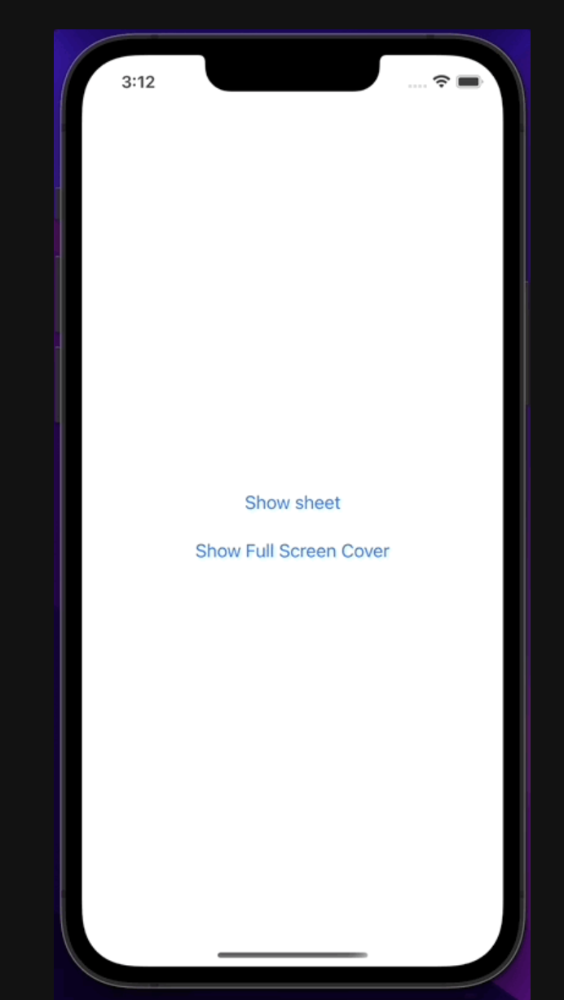
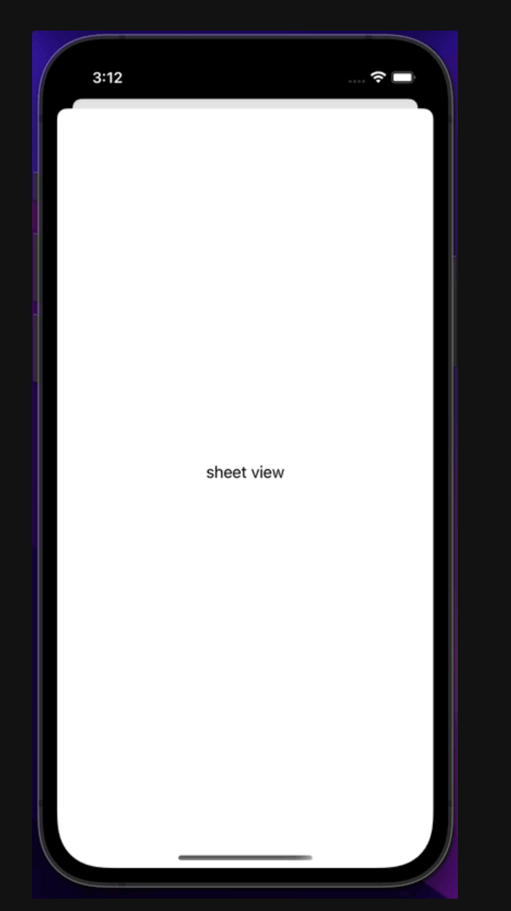

# Screen & FullScreenCover
SwiftUI에서는 뷰를 중첩하기 위한 방법으로 .Screen과 .FullScreenCover가 있다!!

```swift
import SwiftUI

struct MySheetAndFullScreenCover: View {
    
    @State var isShownSheet = false
    @State var isShownFullScreenCover = false
    
    var body: some View {
        
        VStack {
            Button {
                self.isShownSheet.toggle()
            } label: {
                Text("Show sheet")
            }
            .sheet(isPresented: $isShownSheet) {
                Text("sheet view")
            }
            .padding()
            
            Button {
                self.isShownFullScreenCover.toggle()
            } label: {
                Text("Show Full Screen Cover")
            }
            .fullScreenCover(isPresented: $isShownFullScreenCover) {
                Text("Full Screen Cover")
            }
        }
    }
}
```
다음과 같이 .sheet 방식과 .fullScreenCover방식으로 짰을 때



이런식으로 뜰 것이다.

#### 만약 여기서 Show sheet 버튼을 누르게 되면



이런식으로 .sheet형태로 보여지게 될 것이고,
#### Show Full Screen Cover 버튼을 누르게 된다면


이런식으로 .FullScreenCover 형태로 보여지게 될 것이다.

___
이상으로 Sheet와 FullScreenCover에 대한 공부를 마치도록 하겠다.