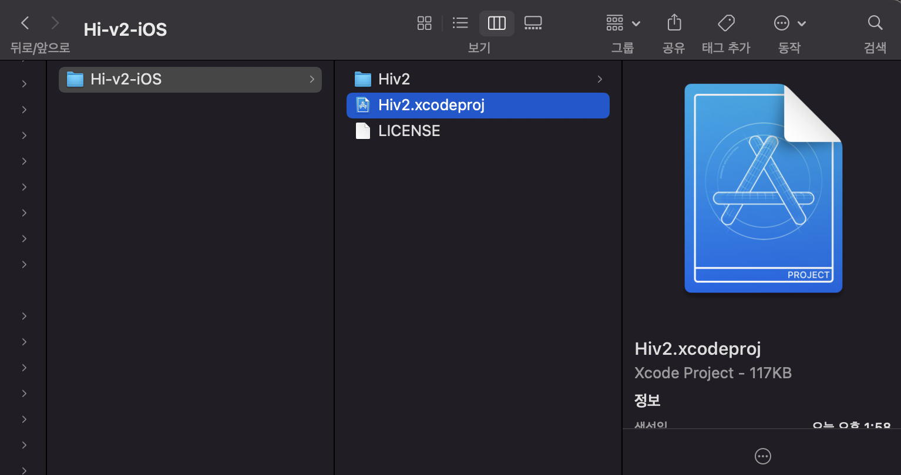

# Git Conflict
개발자로서 다들 협업을 한번씩 해봤을 것이다.

(안해봤을 수도 있지만...ㅎ)

### 쨌든!

협업하다가 보면 conflict가 나는 상황이 발생할 것이다!

### 여기서 conflict 나는 이유!
만약에 한명이 BaseVC에서 수정을 했는데 또 다른 한명이 BaseVC에서 수정을 했을 때 서로 같은 줄을 수정했다면 conflict가 발생하게 된다!

## Xcode에서 VS로 Conflict 오류 해결 방법

### 1.다음과 같이 conflict난 파일을 찾는다.

### 2. VSCode에서 위 파일을 개봉한다.

### 3. 위와 같이 현재 변경 사항과 수신 변경 사항이 있는 곳을 찾는다.
 만약에 위쪽만 필요하다면 수신 변경 사항을 지워버리고, 아래쪽만 필요하다면 현재 변경 사항을 지워버리고, 만약 둘 다 필요하다면 <<<<<<<, >>>>>>>, ======= 이 줄들만 지워주면 된다!!!

 ___
 이상으로 VSCode로 conflict를 해결하는 방법에 대해 마치도록 하겠다.