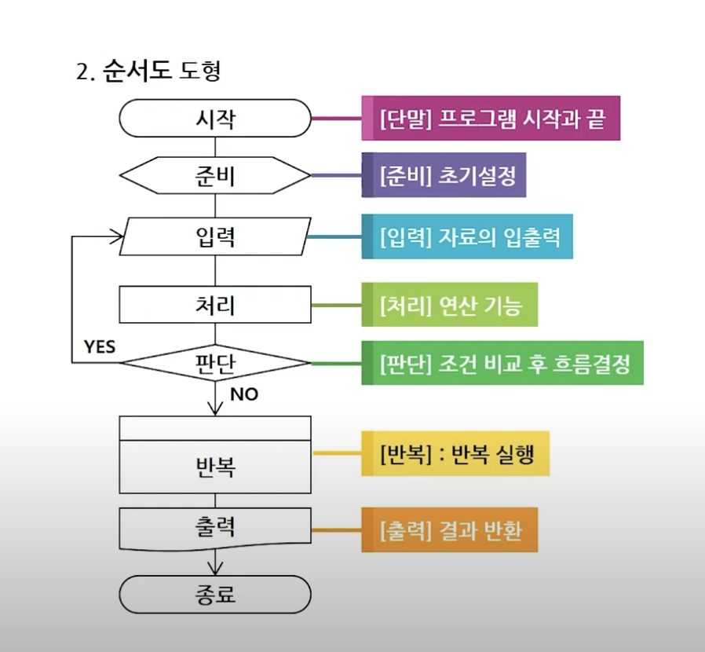

# 알고리즘 구현
## PATH 01. 알고리즘
1. 알고리즘이란?
- 자료구조와 함께 프로그램을 구성하는 요소
- 어떤 문제에 대한 답을 찾는 해법
- 프로그램 작성 과정 중 설계/계획 단계에 포함
- 문제 해결을 위한 일련의 절차나 방법을 공식화한 형태
- 계산을 실행하기 위한 단계적 절차
2. 알고리즘 5가지 특성
   - 입력 : 외부로부터 입력되는 자료가 0개 이상이어야 한다.
   - 출력 : 출력되는 결과가 1개 이상이어야 한다.
   - 명확성 : 각 명령어의 의미가 명확하여야 한다.
   - 유한성 : 정해진 단계를 지나면 종료되어야 한다.
   - 유효성 : 모든 명령은 실행이 가능한 연산들이어야 한다.
  
## PATH 02. 순서도
1. 순서도란?
   - 알고리즘을 표현하는 여러 방식 중 하나이다.
   - 미리 약속된 기호와 그림을 통해 논리적 절차, 흐름, 연산 등을 시각적으로 표현한 것을 말한다.
2. 순서도 도형
   
3. 순서도 연산
   1) 순서도 산술 연산
      - (+) : 더하기
      - (-) : 빼기
      - (*) : 곱하기
      - (/) : 나누기
      - (%, MOD) : 나머지
      - (^) : 거듭제곱
   2) 순서도 관계 연산
      - (>) : 크다 (초과)
      - (>=) : 크거나 같다(이상)
      - (<) : 작다 (미만)
      - (<=) : 작거나 같다(이하)
      - (=) : 같다
      - (<>,!=) : 같지 않다
4. 순서도의 기본 공식
   1) 변수와 상수
      - 변수 : 고정되어 있지 않은 값.
              어떤 값을 저장하기 위해 사용하는 공간.
      - 상수 : 고정되어 있는 값.
              이미 지정되어 있는 변하지 않는 값.
   2) 수의 증감
      - 수(i)의 기본 값이 설정되어 있는 경우.  
       i = i + 1 
       i = i - 1
      - 기본 값이 설정되어 있지 않은  수(i)의 감소 
       i = 고정값 - 변수 
   3) 합의 공식
      - 합계 = 합계 + 수(i)
   4) 평균 공식
      - 평균 = 합계 / 개수(cnt)
   5) 부호(s) 변경 (+ -> - or - -> +)
      - s = 1 or s = -1 --> s= s * (-1)
   6) 몫과 나머지
      - 몫 : 값 / 수 (결과 값을 정수형으로 표현 -> Int)
      - 나머지 : 값 mod 수, 값 % 수
      **나머지 활용!**
      값 mod 2 = 0 -> 값은 짝수
      값 mod 1 = 0 -> 값은 홀수
      값 mod 2 != 0 -> 값은 홀수
      값 mod 3 = 0 -> 값은 3의 배수
   7) 배열 (수열)
      - 배열은 번호에 대응하는 데이터들로 이루어진 자료구조
      - 표현 : 배열명[배열 길이]
   