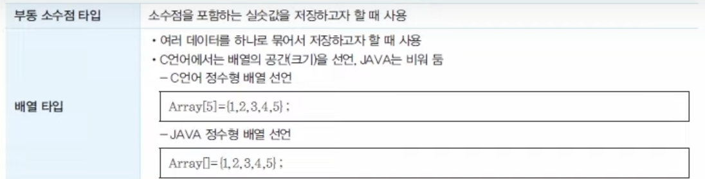

# 프로그래밍 언어 활용
## 01. 프로그래밍 언어 활용의 개요
### 프로그래밍 언어란?
- 컴퓨터 시스템을 동작시키기 위한 프로그램 작성 언어를 말한다.
- 프로그램은 다소 단순해 보이는 명령어들의 조합으로 구성되는데, 이러한 조합들은 비트라고 불리는 0이나 1의 값으로 작성되거나 변환되어 컴퓨터가 이해할 수 있도록 한다.

### 1. 비트(bit)
비트란? <br>
- 컴퓨터가 이해하기 위한 가장 기본적인 용어로, Binary Digit의 약칭이다.
- 0과 1로만 구성된 이진법을 이용하여, 컴퓨터를 이용 시 흔히 접할 수 있는 1바이트는 8비트를 의미한다.


### 2. 컴퓨터 시스템 구조
- 컴퓨터는 전달받은 0과 1의 값들을 정해진 순서대로 실행하며 그 과정에서 처리, 저장 등을 수행한다.
- 프로그램 실행 및 데이터 처리는 중앙처리장치에서 수행하고, 저장은 기억장치에서 수행하며, 중앙처리장치로부터 명령을 받아 데이터를 입력 또는 출력하는 일은 입출력 장치에서 수행한다.


- 중앙처리장치에서는 목적에 따라 연산 등을 수행하는데, 연산을 위한 명령어를 실행하고 기록하기 위해서는 일반적으로 '인출, 해석, 실행, 기록'의 단계를 거쳐야 한다.


## 02. 프로그래밍 언어의 기본 문법 및 용어
### 1. 프로그래밍 기본 용어
- 변수 : 어떤 값을 주기억장치에 기억하기 위해서 사용하는 공간을 의미한다.
- 식별자 : 프로그램의 구성요소를 구별하기 위한 기준으로, 변수명이 식별자에 속한다.
- 바인딩 : 변수와 변수에 관련된 속성을 연결하는 과정으로, 정작 바인딩과 동적 바인딩으로 구분된다.
    - 정적 바인딩 : 프로그램 실행 시간 전에 속성을 연결하는 방식
    - 동적 바인딩 : 프로그램 실행 시간에 속성을 연결하는 방식
- 선언 : 변수에 이름, 데이터 타입 등의 속성을 부여하는 작업으로, 명시적 선언과 묵시적 선언으로 구분된다.
    - 명시적 선언 : 선언문을 이용하며 변수 이름을 나열하고 속성을 부여하는 방식
    - 묵시적 선언 : 별도의 선언문 없이 디폴트 규칙에 의해 속성을 부여하는 방식
- 영역 : 이름이 사용되는 범위를 의미하며, 정적 영역과 동적 영역으로 구분된다.
    - 정적 영역 : 변수를 찾을 때 구조에 기반하는 방식
    - 동적 영역 : 변수를 찾을 때 구조보다는 순서에 기반하는 방식
- 할당 : 변수에 메모리 공간을 바인딩하는 작업을 의미한다.
- 데이터 타입 : 변수가 가질 수 있는 속성값의 길이 및 성질을 의미한다.
- 연산자 : 데이터 처리를 위해 연산을 표현하는 기호로 +,- 등과 같은 연산자를 포함한다.
-  명령문 : 프로그램을 구성하는 문장으로, 지시 사항을 처리하는 단위를 의미한다.
### 2. 변수와 데이터 타입 
1. 변수
변수는 저장하고자 하는 어떠한 값이 있을 때, 그 값을 주 기억장치에 기억하기 위한 공간을 의미한다.
2. 변수 선언 규칙
* 변수는 프로그램 소스코드의 공유, 유지 관리, 표준화 등을 위해 일정한 규칙에 따라 작성된다.
* 변수 선언의 대표적인 규칙
  - 영문 대문자/소문자, 숫자, 밑줄의 사용이 가능
  - 변수 이름의 중간에는 공백을 사용할 수 없음
  - 이미 사용되고 있는 예약어(키워드)는 변수로 사용할 수 없음
```
예약어란?

for, short, union, if, char 등과 같이 프로그래밍 언어에서 이미 사용하고 있는 단어를 의미한다.

```
1. 데이터 타입
변수에 들어갈 값의 특성을 구분하여 그 특성에 맞게 저장할 수 있도록 하는 데이터 속성값의 길이 및 성질을 의미한다.
1. 데이터 타입 유형
* 프로그래밍 언어에 따라 데이터 타입의 유형을 구분하는 기준에 차이가 있다.
* 일반적으로 아래와 같은 유형으로 나눈다.




5. 서식 지정자
* 변수 혹은 값을 출력문을 통해 출력하기 위해 사용한다.
* printf는 문자열만을 출력하며, 이스케이프문과 같이 문자열 선언을 탈출하여 변수를 인식시키는 것을 서식 지정자라고 한다.
```
이스케이프문이란?

출력문 내에서 특정 단축키 및 단어를 출력하기 위한 구문입니다.

예) \n : 강제 개행, \t : 탭
```


## 연산자
* 프로그램 실행을 위해 연산을 표현하는 기호로, 프로그램 내에서는 +,-와 같은 연산자가 사용된다.
* 연산자에는 산술 연산자, 시프트 연산자, 관계 연산자, 논리 연산자 등이 있다.
1) 산술 연산자
* 종류

* 산술 연산자 우선 순위 : 프로그래밍 언어도 수학과 동일한 연산자 우선순위를 따른다.


```
같은 우선순위 안에서는 왼쪽부터 우선적으로 연산합니다.
```

2) 시프트 연산자
* 10진수의 값을 2진수로 변환하여 비트의 위치를 이동시키는 연산자


3) 관계 연산자
* 두 피연산자 사이의 크기를 비교하는 연산자이다.
* 참(True)과 거짓(False)을 구분한다.


4) 논리 연산자
* 두 피연산자 사이의 논리적인 관계를 정의하는 연산자이다.


```
주의할점!!
정보처리기능사 시험은 주관식 답안으로 출력문 안에서 강제개행과 띄어쓰기에 주의해야 한다. 문제에서 줄바꿈을 제시할 때 답안에 줄바꿈을 하지 않고 한 줄로 작성 시 오답 처리됩니다.
```
5) 비트 연산자
* 비트 연산자는 0과 1의 각 자리에 대한 연산을 수행하며, 0 또는 1의 결과값을 가진다.
* 보통 우리가 쓰는 단위를 10진수라고 표현하며, 컴퓨터의 언어를 이진수(비트)로 표현한다.
* 예
  - 1 -> 0000 0001
  - 2 -> 0000 0010
  - 3 -> 0000 0011
  - 10 -> 0000 1010


6) 증감 연산자
* 피연산자를 1씩 증가시키거나 감소시킬 때 사용하는 연산자이다.
* 부호의 위치에 따라 전위 연산자와 후위 연산자로 구분한다.
  - 전위 연산자(++a, --a) : 피연산자 증감 후, 해당 라인 연산 수행
    ```C++
    int a = 5; int b = 5;
    printf("%d %d", ++a, --b); // 결과 : 6 4
    printf("%d %d", a, b); // 결과 : 6 4
    ```
  - 후위 연산자(a++, a--) : 해당 라인 연산 수행 후, 피연산자 증감
    ```C++
    int a = 5; int b = 5;
    printf("%d %d", a++, b--); // 결과 : 5 5
    printf("%d %d", a, b); // 결과 : 6 4
    ```
7) 복합 대입 연산자
* 산술 연산자와 대입 연산자를 간결하게 사용하는 작업이다.

8) 삼항 연산자
* 조건에 부합할 경우, True와 False에 해당하는 값을 출력하는 연산자이다.
```
조건 ? True : False
// ? = 조건과 결과 구분
// : = 참과 거짓 구분